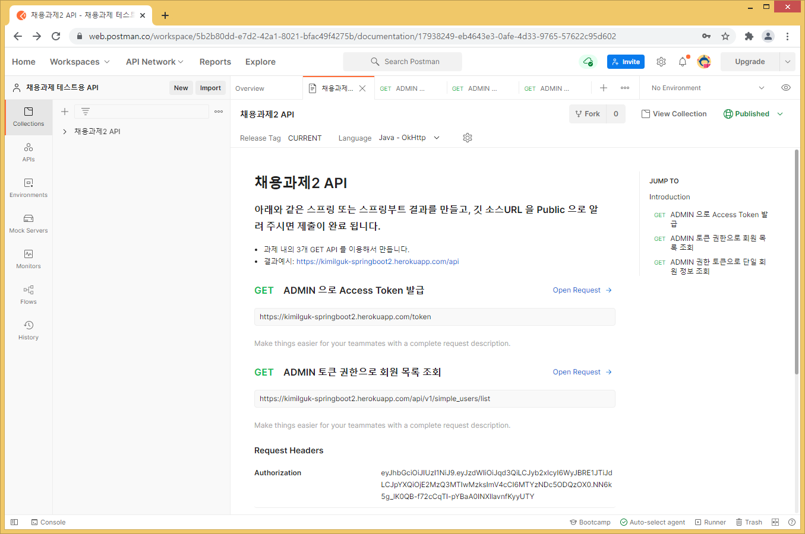
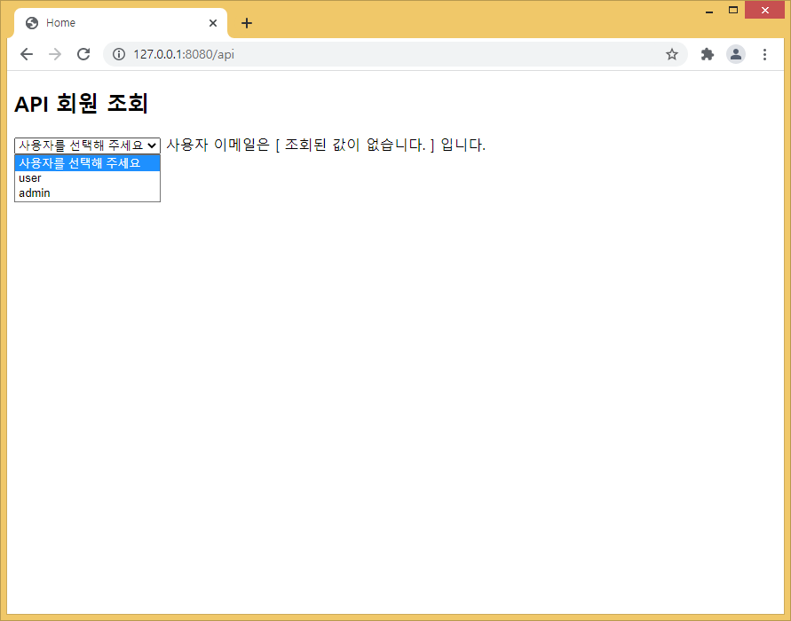

#### Json Web Token 을 사용해서 API 서버로 토큰발급과 API 사용환경 테스트
- 결과 깃 소스 [기존 브랜치-master]https://github.com/miniplugin/springboot2-kimilguk/tree/master
- 결과 헤로쿠 배포: https://kimilguk-springboot2.herokuapp.com/
- Git 추가작업(신규 브랜치-jwt): API 서버로 사용
- 사용예시1: 서버는 "ADMIN 관리자로 로그이됨" 토큰을 생성하여 이를 클라이언트에 제공할 수 있게 만든다.
- 사용예시2: 클라이언트는 해당 토큰을 사용하여 ADMIN 사용자로 로그인됨을 이용하여 회원 목록과 회원 이메일을 확인할 수 있게 만든다. 
- API 서버에서 simple_users 엔티티에 email 필드 추가
- h2 데이터베이스 사용시: http://localhost:8080/h2-console/

#### 20211020(수): 작업
- API 서버 헤로쿠에 배포 및 postman 연동작업. https://kimilguk-springboot2.herokuapp.com/api
- 포스트맨 웹용: https://web.postman.co/ -> 화면 오른쪽 상단 Publication 메뉴로 채용과제 오픈
  
- 채용과제2생성: https://documenter.getpostman.com/view/17938249/UV5XjJ72#intro

#### 20211019(화): 작업
- Principal 정보: https://coding-nyan.tistory.com/127
- 지금까지 작업한 것은 로그인까지 연동된 소스라서 복잡함. 기존 simple_users DB 사용자를 기준으로 토큰인증 기술로 변경.
- 로컬 결과 확인: http://127.0.0.1:8080/api
  
- 단, 아래 처럼 SecurityConfig 에서 토큰을 사용할때는 세션 사용을 중지해야 합니다. 일반 서버로 사용할때는 주석 처리 해 주세요.
```
.sessionManagement().sessionCreationPolicy(SessionCreationPolicy.STATELESS)
.and()
```
- 작업한 핵심 파일명(검색키워드 jwt): SecurityConfig, JwtProvider, JwtAuthenticationFilter, JwtRestController, api.html, application-jwt.properties
- JwtController(토큰값 발행 변수 생성추가), api.mustache

#### 20211018(월): 토큰발행 JwtRestContirller.java
- com.edu.springboot2.jwt 패키지로 정리: 지금까지 Json Web Token 작업 한 파일들 몰아 놓음
- 어제 이어서 7번 부터 참조: https://ws-pace.tistory.com/82?category=964036
- 단, 회원가입자 한해서 토큰을 발급하지않고, /token 접근시 무조건 발급하게 처리한다.

#### 20211017(일): 현재 모든 작업은 jwt 키워드로 검색 가능
- RestAPI 구조에서 스프링시큐리티 > JWT(Json Web Token) 을 사용하는 이유(아래)
- 클라이언트 쪽 RestAPI 구조에서는 로그인 폼이 따로 존재하지 않으므로 인증권한이 없다는 오류를 JSON 형태로  반환:아래 클래스
- 서버에서 UsernamePasswordAuthenticationFilter 인증 클래스 작동전 Json 반환값을 처리해야 한다.
- 서버는 클라이언트의 로그인 정보를 저장하지 않고 토큰기반의 인증 메커니즘으로 작동되므로 무상태로 작동된다.
1) JWT 외부 의존성 추가. implementation 'io.jsonwebtoken:jjwt:0.9.1'
2) jwt_users 엔티티 생성 및 레포지토리(CRUD 메서드 자동생성) 생성 
3) JwtProvider 클래스 생성: Jwt 로 인증정보를 조회 및 권한 조회 메서드
4) CustomUserDetailsService 서비스 생성: 인증정보(토큰조회) 결과를 UserDetails 로 반환 메서드
5) 기존 SecurityConfig.java 에 .addFilterBefore 메서드로 필터를 추가한다
6) 일반적으로 회원가입자 한해서 토큰을 발급하지만, 현재는 /token 접근시 무조건 발급하게 처리한다.
