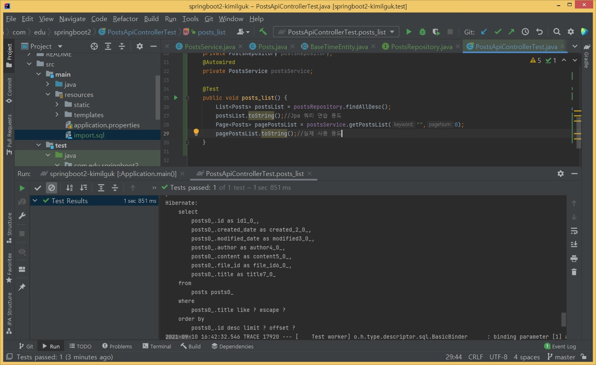
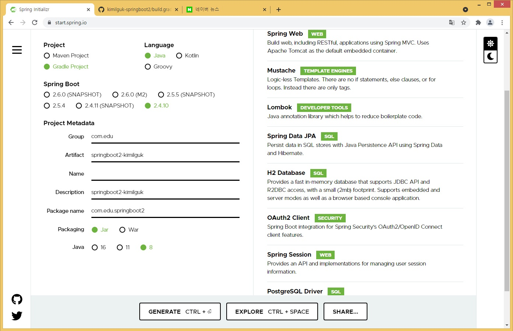
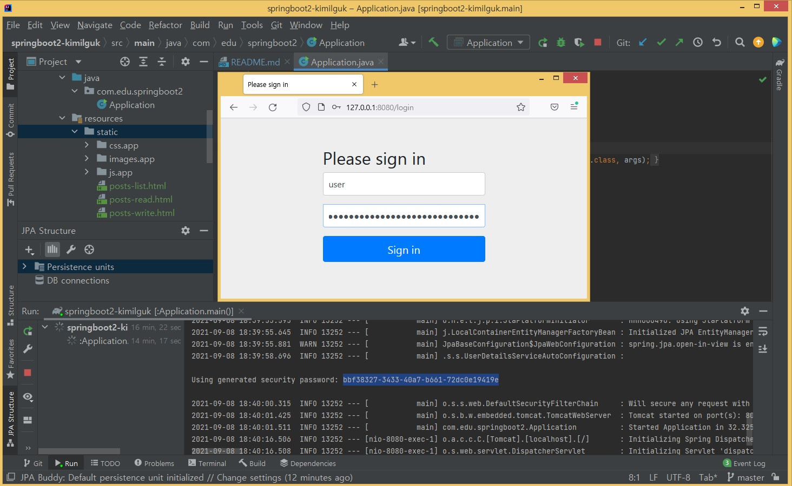

#### 20210912(일) 예정
- 로그인 컨트롤러 테스트 기술참조: https://tlatmsrud.tistory.com/48?category=858575

#### 20210911(토)
- JUnit 테스트 계속, CRUD 중 Create 부터(아래)
- PostsService 클래스에서 save() 메서드 부터 시작
- PostsApiControllerTest 클래스에서 posts_save() 메서드 부터 시작
- 데이터 전송용 임시저장 클래스인 PostsDto 추가
- JUnit5 에서 기본 CRUD 마무리.

#### 20210910(금)
- JUnit 테스트로 Posts CRUD 기술참조: https://tlatmsrud.tistory.com/47 , https://webcoding-start.tistory.com/20
- data 저장용 도메인 생성: @Entity Posts 클래스 와 DB 레이어인 JapRepository 클래스 추가(전체리스트 메서드 findAllDesc() 추가)
- 게시판 Posts 용 더미데이터 import.sql 추가
- CRUD 용 PostsService 클래스 추가. (검색과 페이징 기능추가된 리스트 getPostsList() 메서드 추가)
- PostsApiControllerTest 클래스로 시작. posts_list() 메서드부터 시작(위 서비스의 getPostList() 사용)
  

#### 20210909(목)
- 스프링시큐리티 Config 클래스 생성. 일단 모든 request 에 대해서 퍼미션 all 처리.
- http://127.0.0.1:8080/h2-console 내장 DB툴 실행가능하게 속성추가.
- 외부라이비러리 spring-session-core 하단에 spring-session-jdbc 수동으로 추가.
- /error 처리용 util 컨트롤러 및 머스태치 뷰추가.
- web/IndexController 클래스 생성 및 posts/posts-list.mustache 뷰 생성.
- JUnit 사전지식 : https://goddaehee.tistory.com/211

#### 20210908(수)
- springboot2-kimilguk 프로젝트 생성. https://start.spring.io/ (스프링 initialize 사용)
- 깃 레포지토리 생성 및 연동.
  
- 스프링부트프로젝트에서 사용할 디자인 파일 static 폴더에 이동 후 접속 http://127.0.0.1:8080/posts-list.html
- 접속시 스프링 시큐리티 의존성 때문에 아래와 같은 로그인 절차를 거쳐야 합. 초기 아이디 user / 암호는 아래 화면에서 블럭지정영역에서 확인
  